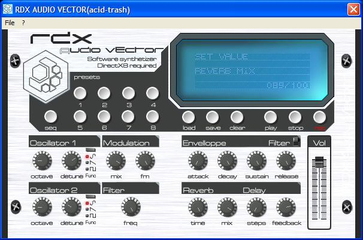

<div align="center">

## \[A virtual synth :: RDX AUDIO VECTOR ß\]


</div>

### Description

This is a virtual synthetizer.

Use DirectX 8 visual basic type library.

Sorry for my horrible english, i'm french.

Need to have some experience in software synthesis.

If not, Open a patch, for example :

patch\adagio for string 3 [] trancepatch.px0

and a sequence, for example

sequence\adagio for strings - bass up.px1

click on the play button.

If you hear gliches, go to file>preferences and increase the latency value.
 
### More Info
 
Need to have some experience in software synthesis.

If not, Open a patch, for example :

patch\adagio for string 3 [] trancepatch.px0

and a sequence, for example

sequence\adagio for strings - bass up.px1

click on the play button.


<span>             |<span>
---                |---
**Submitted On**   |2004-11-23 10:33:56
**By**             |[anotherRDX](https://github.com/Planet-Source-Code/PSCIndex/blob/master/ByAuthor/anotherrdx.md)
**Level**          |Advanced
**User Rating**    |5.0 (134 globes from 27 users)
**Compatibility**  |VB 6\.0
**Category**       |[DirectX](https://github.com/Planet-Source-Code/PSCIndex/blob/master/ByCategory/directx__1-44.md)
**World**          |[Visual Basic](https://github.com/Planet-Source-Code/PSCIndex/blob/master/ByWorld/visual-basic.md)
**Archive File**   |[\[A\_virtual18211411232004\.zip](https://github.com/Planet-Source-Code/anotherrdx-a-virtual-synth-rdx-audio-vector__1-56198/archive/master.zip)

### API Declarations

```
DirectX 8 for vb type library.
Preset load : automation error fixed!
Enhanced wave tables.
Sound device selection added.
Enhanced time management by DJ-Wincha
Multilingual support ! (French-spanish-english)
Enhanced GUI
Noise problem fixed by DJ-Wincha
```


